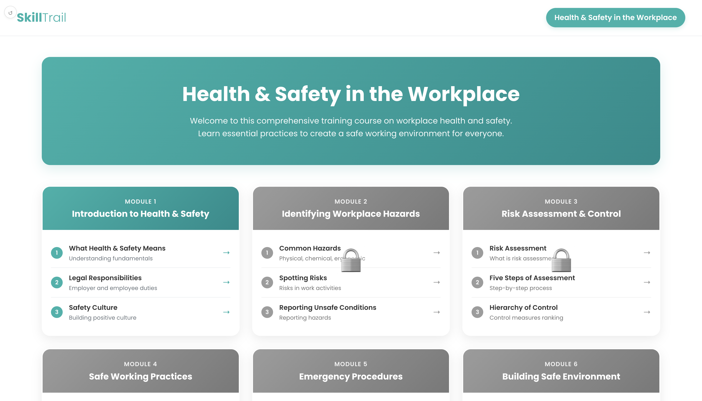
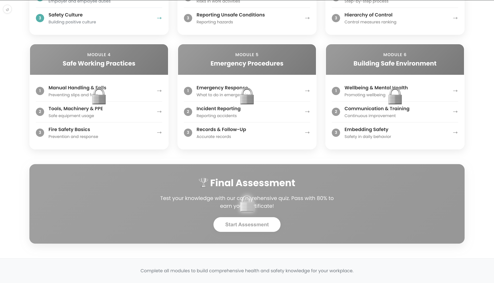
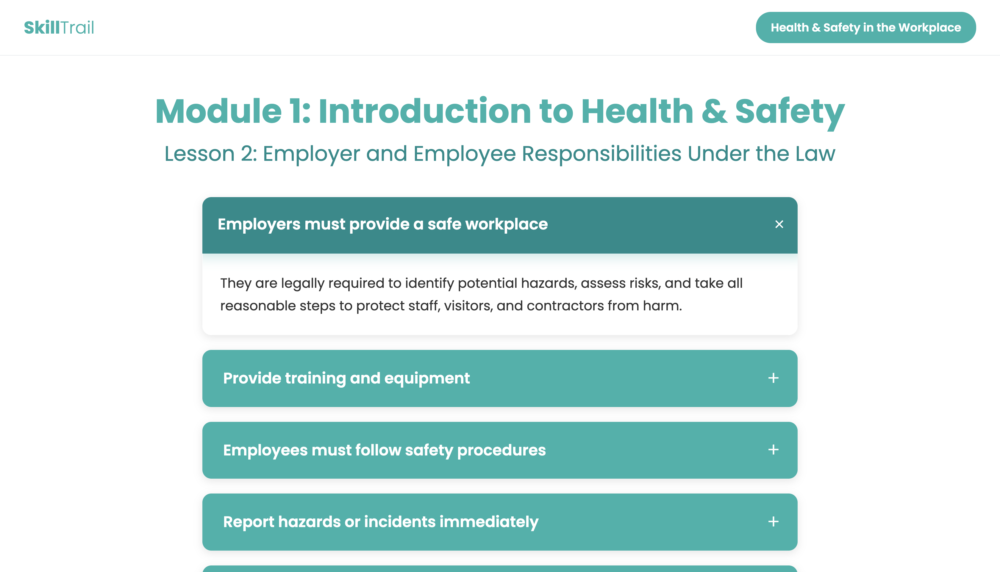
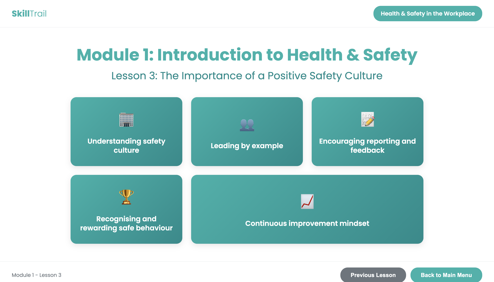

# Workplace Health and Safety Learning Management System (LMS)

<div align="center">

[](https://opensource.org/licenses/Apache-2.0)


**Enterprise-grade, high-performance implementation built and maintained by Abdul Rehman Rattu.**

[Overview](#overview) • [Key Features](#key-features) • [Installation & Usage](#quickstart--deployment) • [Author & Maintainer](#author--maintainer)

</div>

---

A web-based, interactive Learning Management System (LMS) designed for corporate Workplace Health and Safety training. Built with modern HTML5, CSS3, and JavaScript, this application delivers a structured 6-module curriculum alongside an interactive final assessment engine.

---

## Visual Interface Overview

### Course Dashboard


### Interactive Lesson View


### Progress & Module Navigation


### Final Assessment & Quiz Engine


---

## Executive Summary

Workplace Health and Safety is a foundational operational requirement for corporate compliance and employee welfare. This application provides a scalable, zero-dependency web interface that guides employees through structured safety modules, interactive topic reveal cards, and a comprehensive final assessment.

The application is engineered to run seamlessly across all modern web browsers without requiring complex server infrastructure or heavy external frameworks.

---

## Key Features

* **Complete 6-Module Curriculum**: Covers core health and safety topics ranging from hazard identification and risk assessment to emergency procedures and fire safety.
* **Interactive Accordion Mechanics**: Topic cards utilize click-reveal mechanics to ensure active learner engagement. Card header states transition from unread grey to completed green upon interaction.
* **Progress Tracking**: Visual state feedback highlights completed lessons, encouraging sequential learning across all modules.
* **Final Assessment Engine**: Integrated quiz module featuring interactive multiple-choice questions, instant feedback logic, and score calculation.
* **Fully Responsive Design**: Optimized layout adapted for desktop computers, laptops, tablets, and mobile smartphones.
* **Accessibility and Print Support**: Includes clean styling, high contrast color palettes, reduced motion support, and print media queries.
* **Zero Dependencies**: Pure HTML5, CSS3, and JavaScript implementation ensuring high performance and simple maintenance.

---

## Detailed Curriculum Structure

### Module 1: Introduction to Health and Safety
* Lesson 1: What Health and Safety Means and Why It Matters
* Lesson 2: Legal Duties of Employers and Employees
* Lesson 3: The Cost of Ignoring Health and Safety

### Module 2: Workplace Hazards and Risk Assessment
* Lesson 1: Identifying Common Workplace Hazards
* Lesson 2: Carrying Out a Simple Risk Assessment
* Lesson 3: The Hierarchy of Risk Control

### Module 3: Slips, Trips, Falls, and Manual Handling
* Lesson 1: Preventing Slips, Trips, and Falls
* Lesson 2: Safe Manual Handling Principles
* Lesson 3: Ergonomics and Display Screen Equipment

### Module 4: Fire Safety and Emergency Procedures
* Lesson 1: Understanding Fire Risks and the Fire Triangle
* Lesson 2: Emergency Evacuation and Action Plans
* Lesson 3: Fire Extinguisher Types and Use

### Module 5: Hazardous Substances and Electrical Safety
* Lesson 1: Working Safely with Hazardous Substances (COSHH)
* Lesson 2: Electrical Safety in the Workplace
* Lesson 3: Personal Protective Equipment (PPE) Essentials

### Module 6: Incident Reporting and Safety Culture
* Lesson 1: Reporting Accidents, Near-Misses, and Hazards
* Lesson 2: Building a Positive Safety Culture
* Lesson 3: Continuous Improvement in Health and Safety

### Final Evaluation
* Comprehensive Final Assessment: Multi-question exam testing knowledge retention across all 6 modules.

---

## Technical Architecture and Stack

* **Markup**: Semantic HTML5 (`header`, `main`, `footer`, `section`) ensuring high accessibility standards and search engine readability.
* **Styling**: Modern CSS3 using CSS Custom Properties (Variables), Flexbox, CSS Grid layouts, and hardware-accelerated transitions.
* **Typography**: Google Fonts (Poppins font family) for elevated readability and corporate interface standards.
* **Scripting**: Vanilla JavaScript (ES6+) utilizing DOM manipulation and event delegation.

---

## Installation and Deployment

### Local Setup
1. Clone the repository to your local directory:
   ```bash
   git clone https://github.com/AbdulRehmanRattu/workplace-health-safety-lms.git
   ```
2. Open the project folder:
   ```bash
   cd workplace-health-safety-lms
   ```
3. Launch `index.html` directly in any web browser.

### Hosting on GitHub Pages
1. Navigate to the repository settings on GitHub.
2. Select the **Pages** menu item from the left sidebar.
3. Under **Branch**, select `main` (or `master`) and set the root folder to `/ (root)`.
4. Click **Save**. The live web application will deploy automatically.

---

---

---

## Author & Maintainer

**Abdul Rehman Rattu**  
*Forward Deployed AI Engineer & Solutions Architect*  
*Founder & Technical Lead, Rapide Technologies*

* **Email**: [rattu786.ar@gmail.com](mailto:rattu786.ar@gmail.com)
* **LinkedIn**: [linkedin.com/in/abdul-rehman-rattu-395bba237](https://www.linkedin.com/in/abdul-rehman-rattu-395bba237)
* **GitHub**: [github.com/AbdulRehmanRattu](https://github.com/AbdulRehmanRattu)
